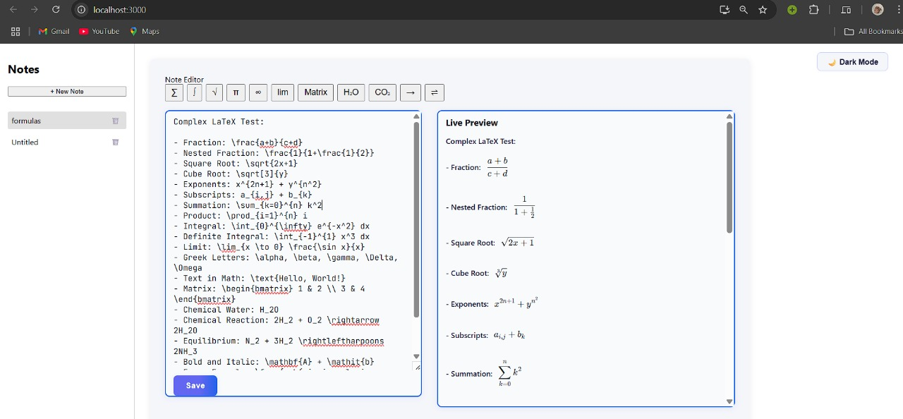

# Notes_Latex

A web application for creating, editing, and managing notes with LaTeX support.

## Features
- **Rich Text Editor**: Write and edit notes with LaTeX equations.
- **Equation Toolbar**: Easily insert LaTeX symbols and equations.
- **Notes List**: View, select, and manage all your notes.
- **Persistent Storage**: Notes are saved and loaded from a backend database.
- **Modern UI**: Built with React and Tailwind CSS for a responsive experience.

## Setup Instructions

### Prerequisites
- [Node.js](https://nodejs.org/) (v14 or higher recommended)
- [npm](https://www.npmjs.com/) (comes with Node.js)
- [MongoDB](https://www.mongodb.com/) (for backend storage)

### 1. Clone the Repository
```
git clone https://github.com/HarshYadv5554/Notes-app-Latex-.git
cd Notes-app-Latex-
```

### 2. Install Server Dependencies
```
npm install
```

### 3. Install Client Dependencies
```
cd client
npm install
```

### 4. Set Up Environment Variables
- Create a `.env` file in the root directory (if required) and add your MongoDB connection string:
  ```
  MONGODB_URI=mongodb://localhost:27017/notes_latex
  ```

### 5. Start the Backend Server
From the project root:
```
npm start
```

### 6. Start the Frontend React App
In a new terminal, from the `client` directory:
```
npm start
```

The React app will run on [http://localhost:3000](http://localhost:3000) and the backend server (by default) on [http://localhost:5000](http://localhost:5000).

## Folder Structure
```
Notes_Latex/
  client/         # React frontend
  models/         # Mongoose models
  routes/         # Express routes
  server.js       # Express server entry point
```

## License
This project is open source and available under the [MIT License](LICENSE). 

## App Screenshot

Light Mode:



Dark Mode:

 
